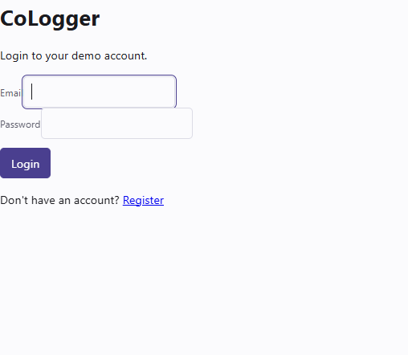
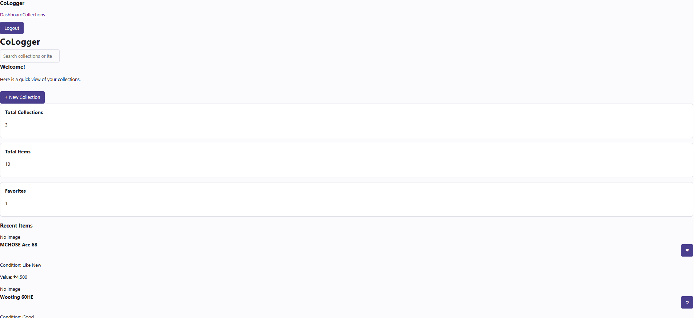
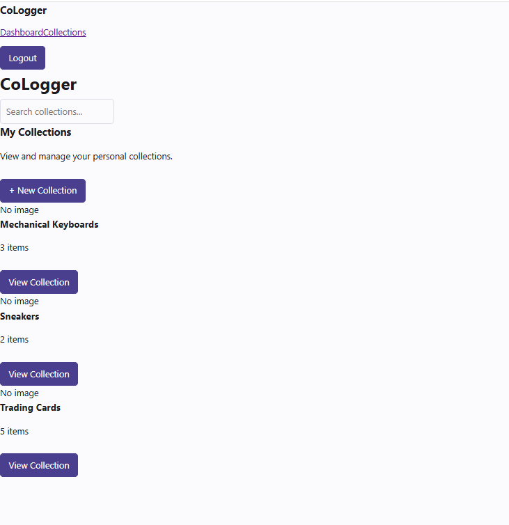

# CoLogger

CoLogger is a React web application for collectors and hobbyists who want to organize and track their personal collections. Users will be able to create collections and keep information about individual items such as condition, estimated value, purchase price, acquisition date, notes, and favorite status.

> Week 1 status: The current build is a frontend demo. The React pages and routes are in place, but the Express API and PostgreSQL database are not yet connected to the CoLogger interface.

## Overview

The goal of CoLogger is to provide a simple digital place for users to keep track of collections such as mechanical keyboards, sneakers, trading cards, figures, games, watches, and other collectibles.

The current Week 1 version focuses on the React frontend, reusable components, routing, and a temporary demo authentication flow.

## Setup and Installation

### Requirements

Install the following first:

- Node.js
- npm
- Git

### Clone the repository

```bash
git clone https://github.com/jmyspn/CoLogger.git
cd CoLogger
```

### Install the client dependencies

```bash
cd client
npm install
```

The current Week 1 frontend demo does not require PostgreSQL to run.

No real credentials should be added to the repository.

## How to Run

From the `client` folder:

```bash
npm run dev
```

Vite will display a local address, usually:

```text
http://localhost:5173
```

Opening the root address redirects to:

```text
/login
```

## Features and Usage

### Current Week 1 Features

The current frontend includes the following planned screens:

- Login
- Register
- Dashboard
- Collections
- Collection Details
- Add Item
- Item Details
- Edit Item

### Demo Authentication

Authentication is currently a temporary frontend demo using browser `localStorage`.

Current flow:

1. Open `/register`.
2. Enter a name, email, and password.
3. Registration stores the demo user's name and email locally.
4. The user is returned to `/login`.
5. Login checks the registered demo email.
6. A temporary demo session is created.
7. The user is sent to `/dashboard`.
8. Logout removes the demo session and returns to `/login`.

This is not the final authentication system. It will later be replaced with server and database authentication.

### Collections and Items

The Dashboard, Collections, Collection Details, and Item Details pages currently use sample data.

The Add Item and Edit Item pages use a shared `ItemForm` component.

Form data can currently be entered, but it is not yet saved to a database.

## Project Structure

```text
CoLogger/
├── client/
│   ├── src/
│   │   ├── components/
│   │   │   ├── atoms/
│   │   │   ├── molecules/
│   │   │   ├── organisms/
│   │   │   └── pages/
│   │   ├── App.jsx
│   │   └── main.jsx
│   └── package.json
│
├── server/
├── docs/
├── screenshots/
├── AI-USAGE.md
├── REPORT.md
├── README.md
└── START-HERE.md
```

## Component Organization

### Atoms

- Button
- Input
- FavoriteButton

### Molecules

- SearchBar
- FormField
- CollectionCard
- ItemCard
- ImageUploader

### Organisms

- Navbar
- Sidebar
- ItemForm
- CollectionGrid
- ItemGrid

### Pages

- LoginPage
- RegisterPage
- DashboardPage
- CollectionsPage
- CollectionDetailsPage
- AddItemPage
- ItemDetailsPage
- EditItemPage

## Screenshots

> Current status: The frontend is still a Week 1 work in progress. The main screens, routes, and reusable components are in place, but the final styling, responsive behavior, navigation actions, and backend/database integration are not yet complete.

### Login



### Dashboard



### Collections



## Known Issues and Next Steps

The project is still in development.

Current known limitations:

- Authentication is only a `localStorage` demo.
- The Express server is not yet connected to the CoLogger frontend.
- PostgreSQL is not yet connected to the CoLogger data.
- Collection and item data is currently sample data.
- Add Item and Edit Item do not persist changes.
- Some buttons and navigation actions are still placeholders.
- Route protection still needs to be added.
- The final CoLogger styling and responsive design still need to be applied.
- Image upload is not yet connected to permanent storage.

Next steps are to finish the frontend navigation and styling, connect the Express API and PostgreSQL database, and replace the demo data with persistent data.

## AI Usage

AI tools were used during development for guidance, code assistance, debugging, and documentation support.

A detailed record is kept in:

[AI-USAGE.md](./AI-USAGE.md)